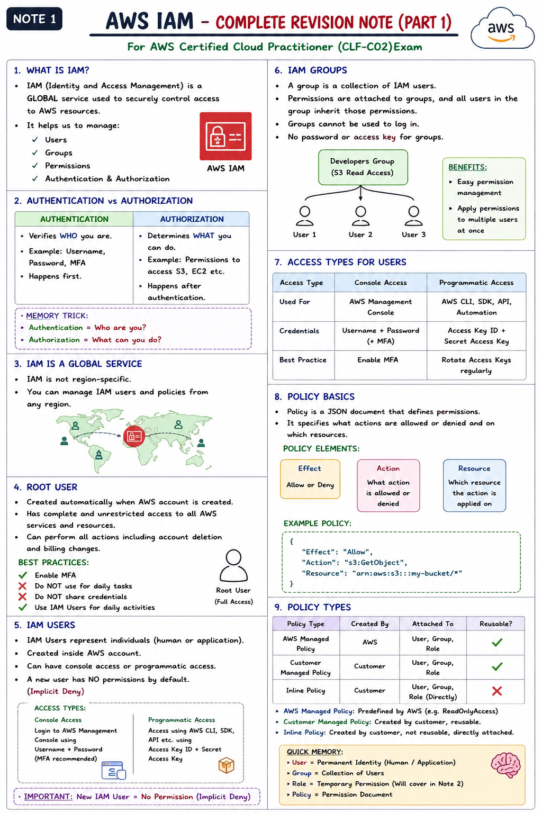
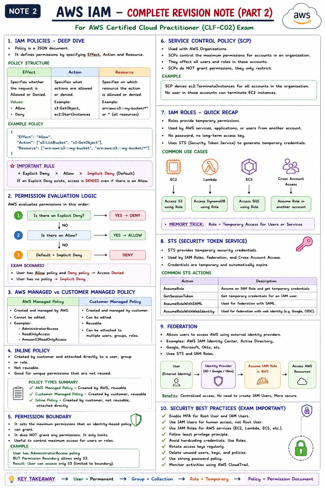
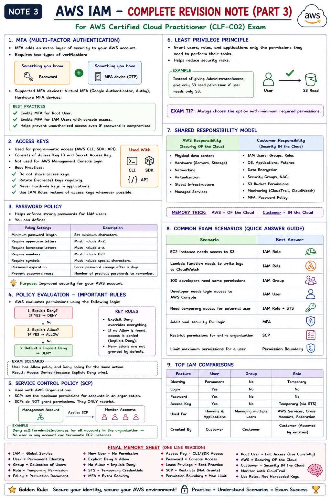
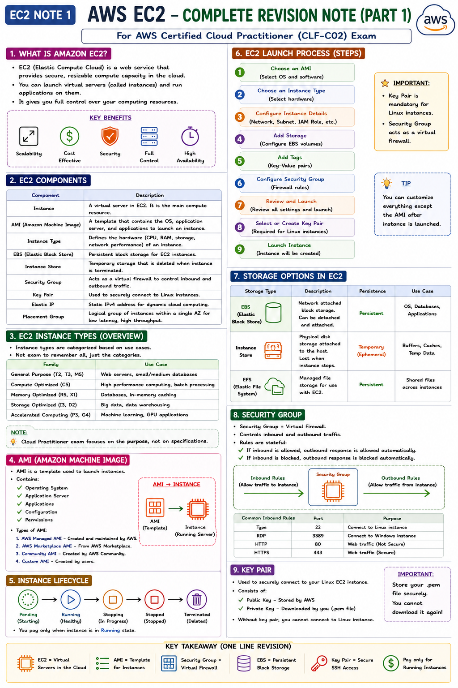
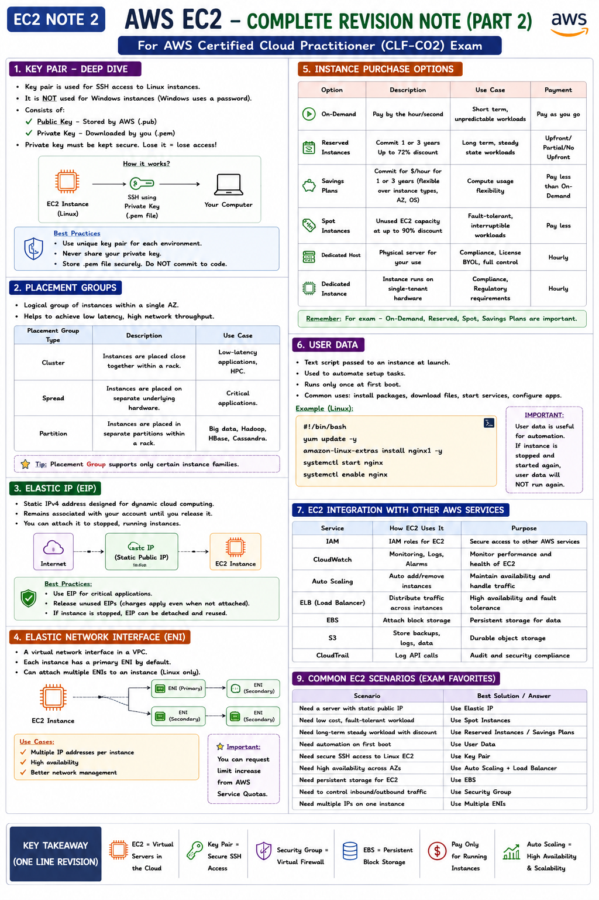
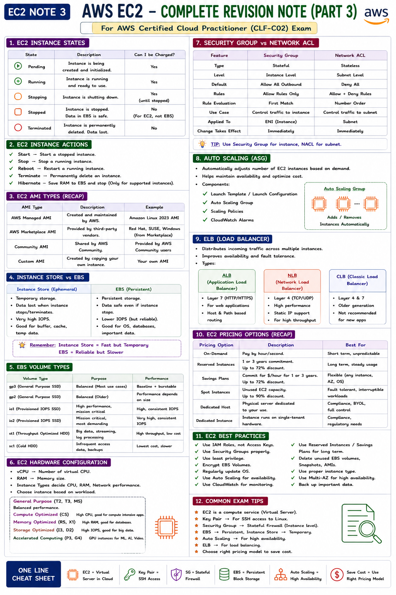
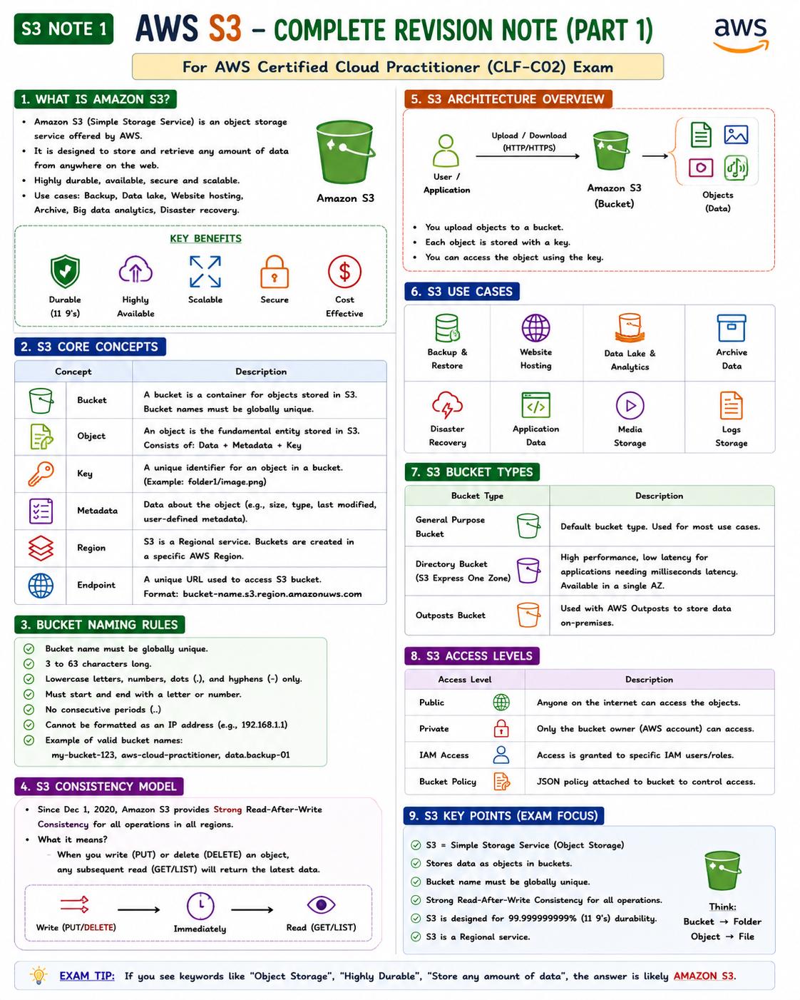
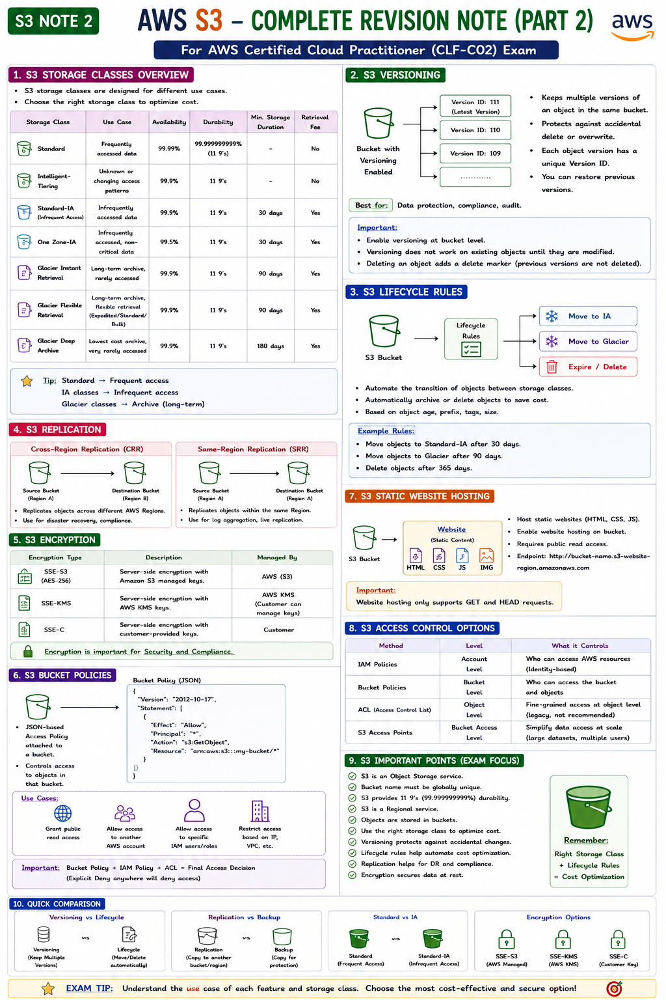
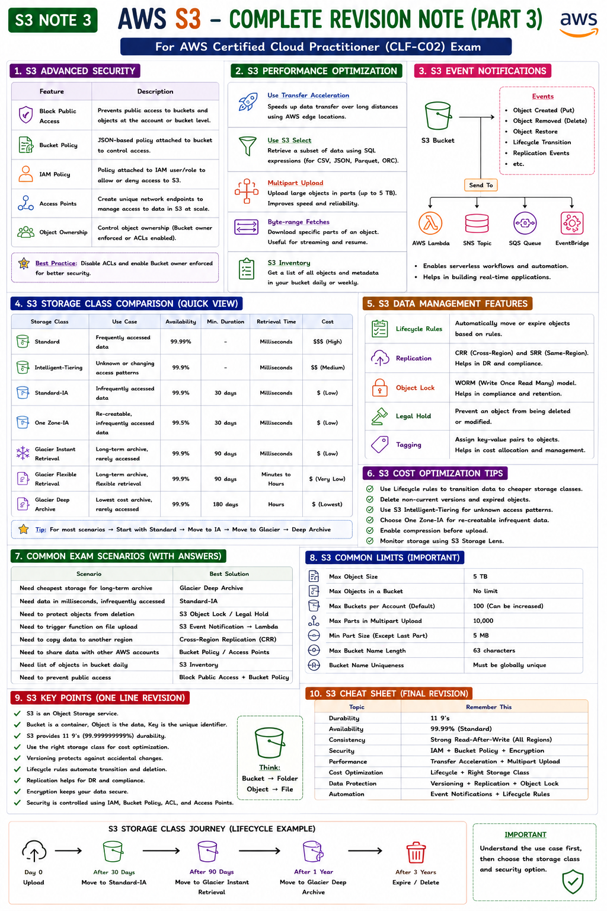

# AWS Technical Guide

### Index
* [Identity & Access Management (IAM)](#iam)
* [Elastic Compute Cloud (EC2)](#ec2)
* [Simple Storage Service (S3)](#s3)

---

## IAM
### 1. Dashboard Overview

### 2. Users and Groups

### 3. Policies and Roles

---

## EC2
### 4. Console Dashboard

### 5. Instance Management

### 6. Security Groups & Key Pairs

---

## S3
### 7. Bucket List

### 8. Object Permissions

### 9. Lifecycle Policies

