# AWS Technical Guide

### Index
* [Identity & Access Management (IAM)](#iam)
* [Elastic Compute Cloud (EC2)](#ec2)
* [Simple Storage Service (S3)](#s3)
* [Relational Database Service (RDS)](#rds)
* [Virtual Private Cloud (VPC)](#vpc)
* [Route 53](#route53)
* [CloudWatch](#cloudwatch)

---

## IAM
### 1. Dashboard Overview

### 2. Users and Groups

### 3. Policies and Roles

---

## EC2
### 4. Console Dashboard

### 5. Instance Management

### 6. Security Groups & Key Pairs

---

## S3
### 7. Bucket List

### 8. Object Permissions

### 9. Lifecycle Policies

---

## RDS
### 10. Database Overview
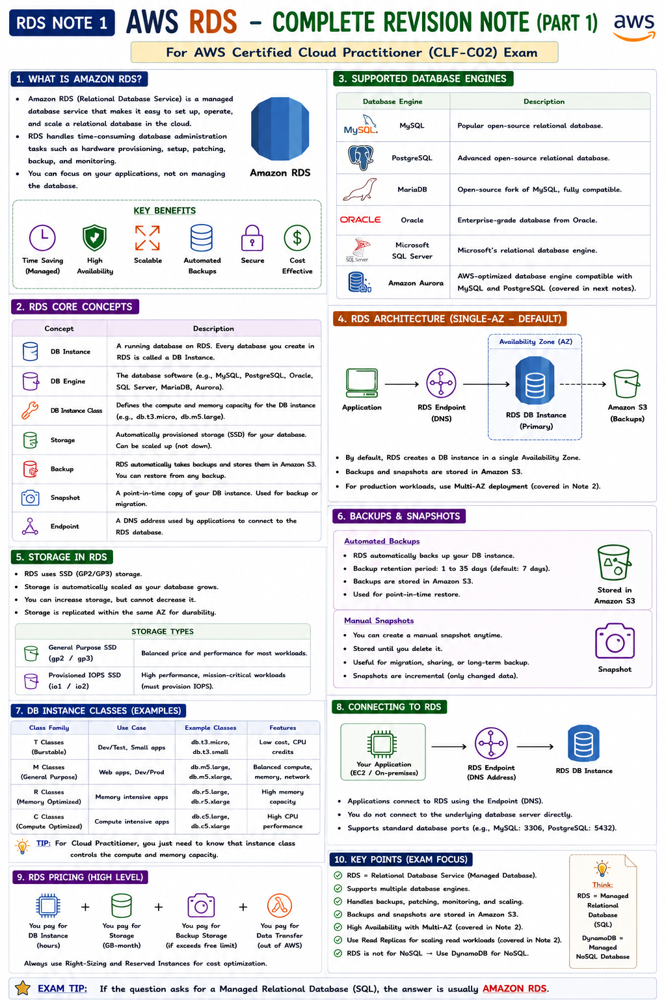

### 11. DB Instances
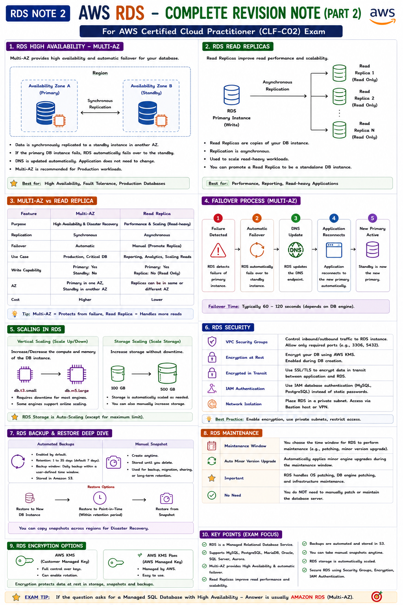

### 12. Security & Connectivity
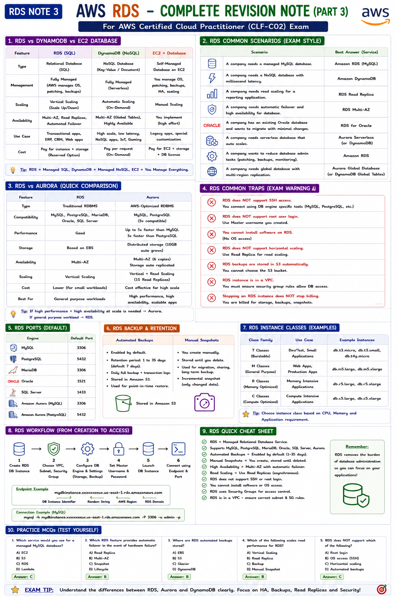

---

## VPC
### 13. VPC Dashboard
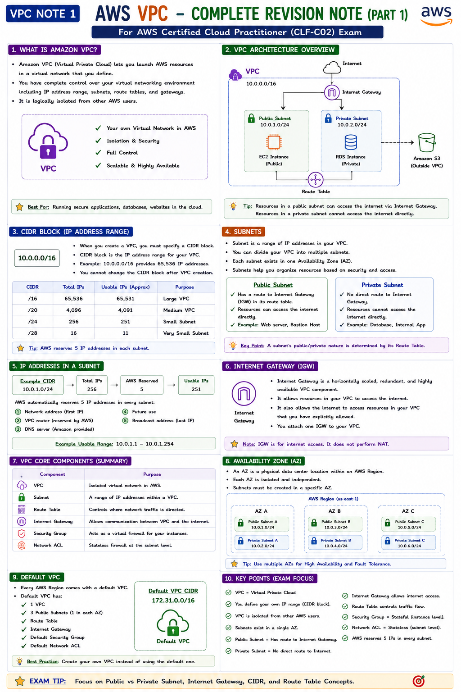

### 14. Subnets and Routing
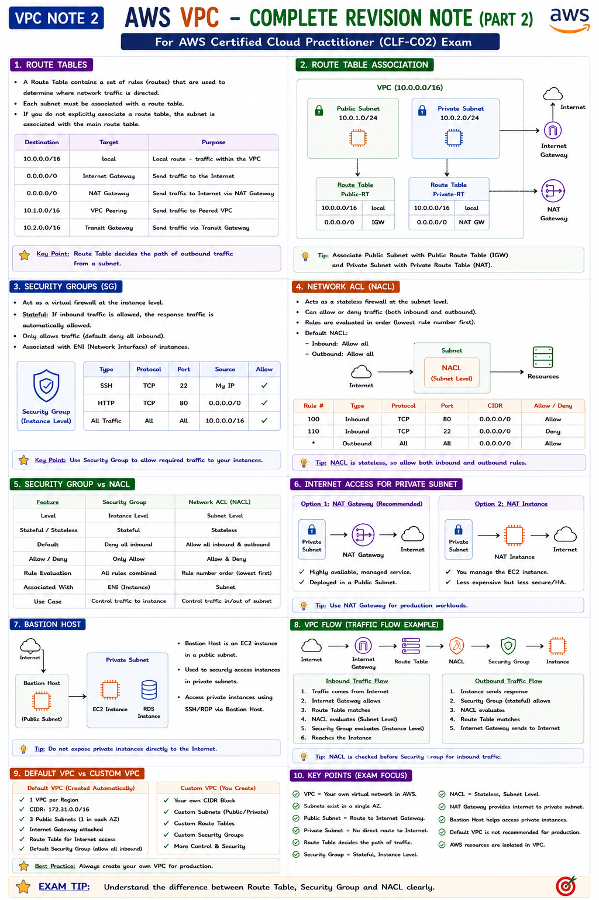

### 15. Internet Gateways
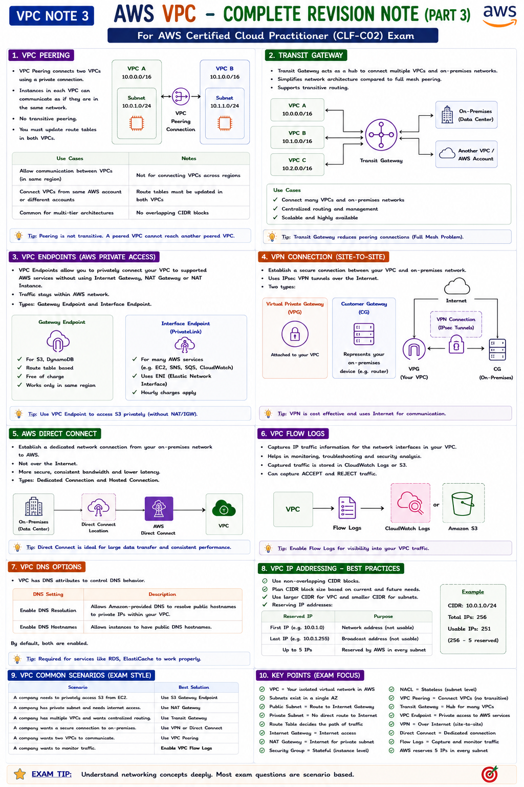

---

## Route 53
### 16. Hosted Zones
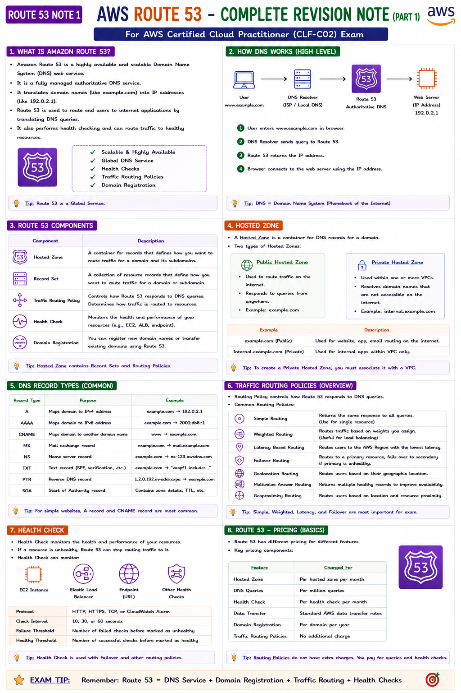

### 17. Record Sets
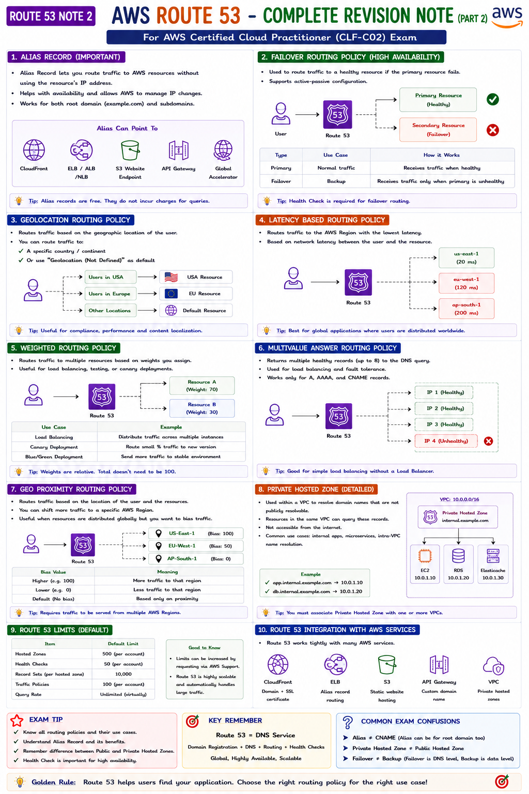

### 18. Health Checks
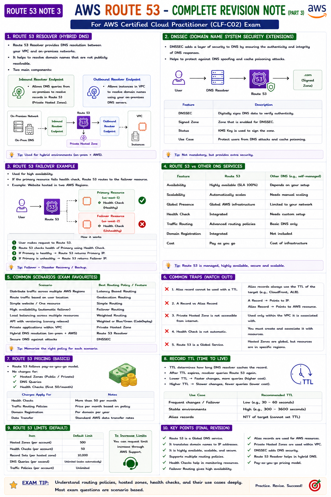

---

## CloudWatch
### 19. Metrics and Alarms
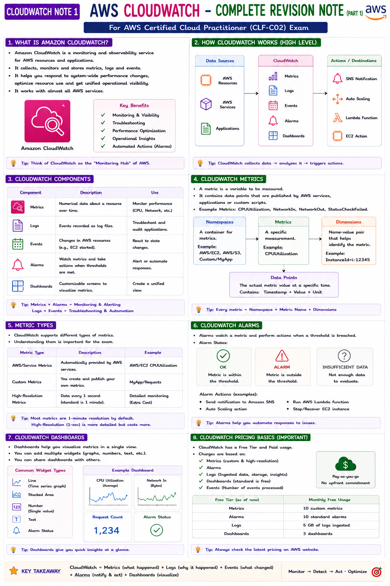

### 20. Logs Management
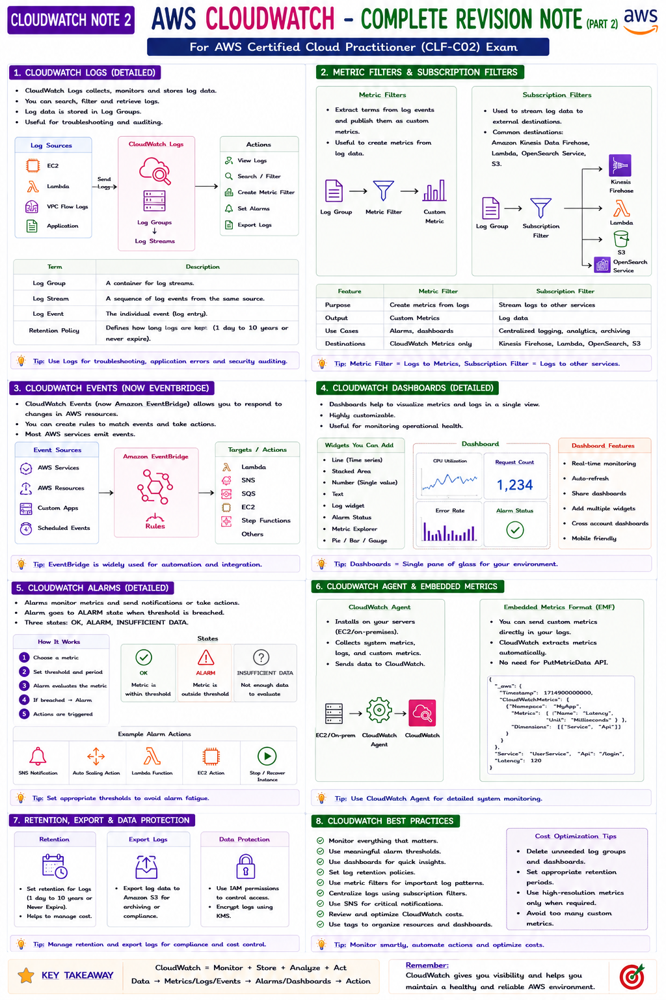

### 21. Dashboards
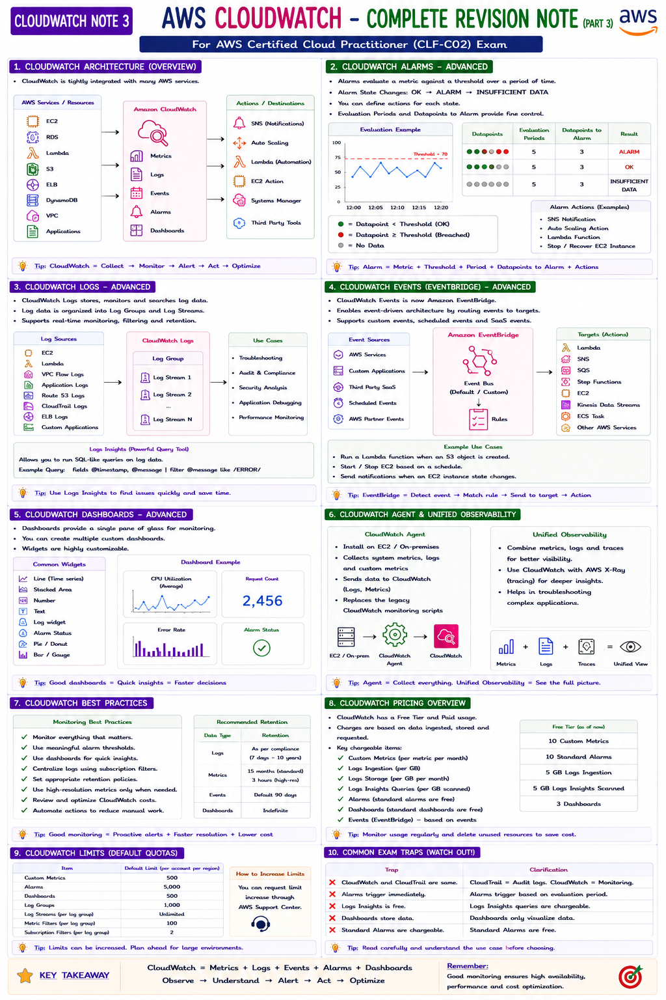
